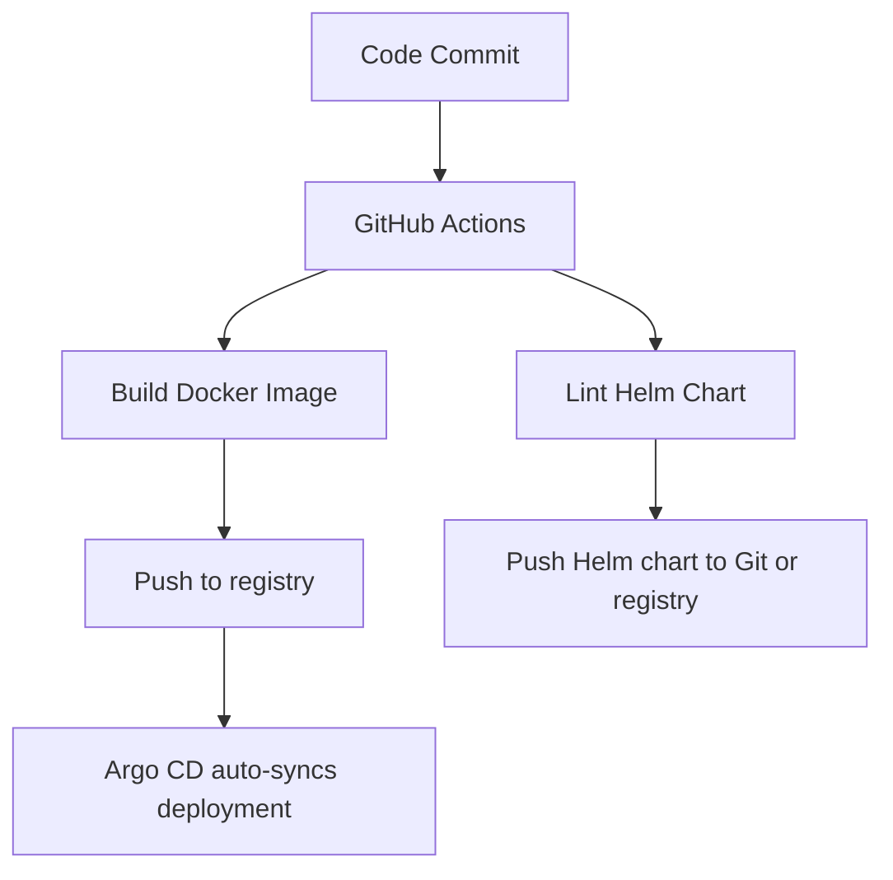

# overview
This solution addresses the task of containerizing a Python script (validate_peptide.py), exposing it via a REST API, ensuring observability, enabling scalability and automating with github. This documentation also list the future work of packaging this microservice as Helm chart for easy deployment cross platforms. The overall approach emphasizes automation, monitorability, and production-readiness — principles that are applied as platform engineer.

## Containerization script
I Packaged the original script as a lightweight, reusable Docker image, so it can:

- Run container from CLI

- Supports Kubernetes deployment and orchestration

- Enables rapid testing and iteration

Key component:

- Used python:3.11-slim as base for size and security

- Set ENTRYPOINT for CLI-style usage (docker run validator "XYZ")

## Creating REST API

I Wrapped the validation logic in a RESTful API using FastAPI, exposing a single-purpose scientific service.

Key components: 

- /validate POST endpoint receives peptide sequence

- API returns validation result in JSON

- /metrics endpoint exposes Prometheus-compatible metrics

## Observability with Logging & Metrics

When talking about observability in this context, there can be two scenarios. 

### 1. Application-Level Observability

Embedded logging and metrics inside the Python code: 

- Logging:	Implemented using Python’s logging module

- Metrics:	Implemented using prometheus-fastapi-instrumentator to expose HTTP request metrics (latency, count, status codes) via /metrics

- Scope:	Internal to the app: tracks what the app is doing

- Purpose:	Debugging, request tracing, usage stats, error tracking

- Consumer:	Humans (developers), Prometheus, stdout via docker logs

Example Use Case:

- Log every peptide sequence received and whether it passed validation

- Track how long each request takes and whether it succeeds (200) or fails (400)

### 2. Infrastructure-Level Observability

External tools (like Prometheus on Kubernetes) observe the runtime behavior of the pod.

- Prometheus scraping: /metrics endpoint is scraped by Prometheus running in the cluster

- ServiceMonitor:	Kubernetes-native way to tell Prometheus to watch a service

- Scope	Outside-in: monitors  service’s exposed metrics

- Purpose:	Aggregated monitoring, dashboards (Grafana), alerting

- Consumer:	Platform team, SREs, dashboards

Example Use Case:

- Monitor HTTP traffic volume to your app across all replicas

- Alert if request errors increase or latency spikes

- Visualize performance over time in Grafana

## 4. Kubernetes Deployment

Deployed the microservice into a local or cloud Kubernetes cluster, to make it easy to scale, manage, and integrate with platform tools.

Key components:

- Used a custom namespace (validator)

- Added CPU and memory requests/limits for predictability

- Included a readiness probe on /metrics

- Kubernetes Horizontal Pod Autoscaler (HPA) based on CPU usage

## 5. Prometheus + Grafana Stack 

Deployed full observability stack using kube-prometheus-stack from Helm chart.

Key components:

- Installed via Helm into monitoring namespace

- Verified Prometheus scraping of validator service

## 6 . Helm Chart for Validator Service

Packaged the microservice as a reusable Helm chart to:

- Simplifies deployment for others

- Supports CI/CD, GitOps, and configuration overrides

Key components:

- Parameterized image, resources, and HPA in values.yaml

- Clean chart layout with templated deployment, service, HPA

- Helm packaging allows reuse across environments

## 7. Infrastructure Automation Plan

To ensure consistency, repeatability, and scalability of the deployment, I would automate the infrastructure using a GitOps + IaC approach.

Key components:

- Terraform:  to provision GCP infrastructure

- Helm: to package and deploy microservice

- Kustomize: for environment overlays

- GitHub Actions: to build and push Docker images, lint Helm charts

- ArgoCD: to trigger auto deployment

GitOps Flow:

- Developer pushes validated chart/image to Git

- Argo CD detects change in gitops/validator/ folder

- Automatically syncs it to Kubernetes

- Rollbacks are easy (revert Git)

## Future work

1. Microservice Lifecycle & Management

- API versioning (/v1/validate) and schema evolution strategy

- Service discovery if part of a broader bioinformatics pipeline

- Ingress / Gateway API to expose it securely to internal/external consumers

- Rate limiting & authentication (e.g., via Kong, Traefik, Istio)

- Dependency tracking: monitor usage across services/pipelines

2. Security Enhancements

- Use Vault

- PodSecurityContext and network policies to restrict access

- Integrate code scanning ( bot, Trivy) in CI pipeline

3. AI Pipeline enhancement

- Batch Mode Support, to accept arrays of peptide sequences

- Store validation results in proper storage like MinIO, S3

- Support for event-based processing 

